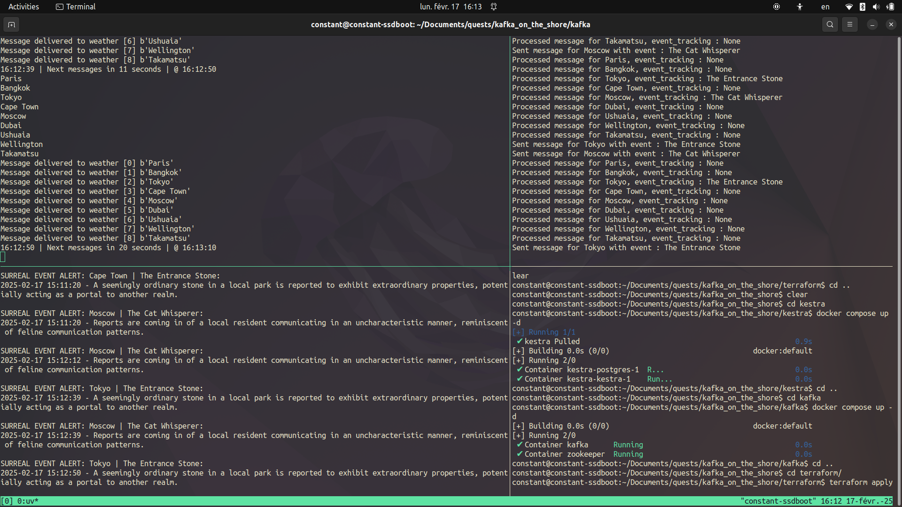
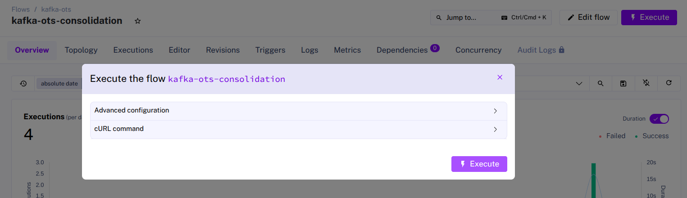
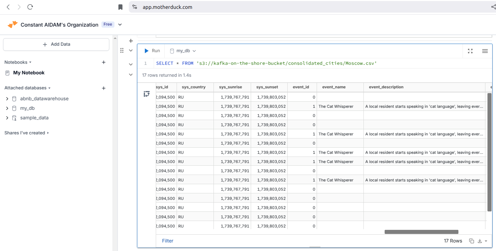

## **Kafka on the Shore - A Surreal Data Engineering Investigation**

### **Overview**
This project is inspired by the novel [*Kafka on the Shore*](https://en.wikipedia.org/wiki/Kafka_on_the_Shore) and serves as both a technical experimentation of real-time streaming with Apache Kafka and an investigative data exploration challenge.  

The premise? Mysterious events are occurring in multiple cities—like fish raining from the sky or a shadowless man walking the streets. To investigate, sensors have been placed in these locations, triggering at random intervals to gather weather data and detect surreal phenomena. 

💭 *Are these events truly supernatural? Or just a trick of the weather?* 

As a **data engineer**, my task is to build an architecture that would enable the capture, storage, and analysis of the data produced by the sensors, ultimately helping to uncover the *weather conditions* under which the events appear.  

### **Tech Stack**
- **Kafka** - Real-time data streaming  
- **Docker & Docker Compose** - Local setup  
- **Terraform** - Infrastructure as Code (resource provisioning)  
- **Kestra** - Workflow orchestration  
- **AWS S3** - Data storage  
- **DuckDB / MotherDuck** - Cloud data Lakehouse for analysis  
- **Python** - Data processing & consumers  

---

### **Project Architecture**


🚀 The pipeline consists of several key components:  

1. **Kafka Producer**  
   - Simulates the surreal sensor, collecting weather data at random intervals from multiple cities.  
   - Uses OpenWeather API for real-time weather information.  
   - Publishes messages to a Kafka topic (`weather`).  

2. **Kafka Consumers**  
   - Reads weather data from Kafka.  
   - Detects if a surreal event occurred based on specific weather conditions (encoded in Python).  
   - Stores processed data into AWS S3.  

3. **Kestra Orchestration**  
   - Automates the consolidation of files uploaded to S3.  
   - Runs on a scheduled basis using Docker.  

4. **MotherDuck (DuckDB Cloud)**  
   - Queries consolidated event data directly from S3.  
   - Enables easy analysis of patterns and weather conditions associated with surreal events.  


5. **Secure Secrets Management with Vault**  

    To keep sensitive information secure, **HCP Vault** can be used to store credentials such as:  
    - AWS keys (for S3 access)  
    - Kafka broker details  
    - OpenWeather API keys  
    - Cities list for weather tracking  

    A **Terraform integration** is provided to automatically write secrets to Vault, making management easier. However, using Vault is **optional**—the project runs without it.

---

### **Investigative Challenge**  

📌 Now that we have all the infrastructure in place, this project can also serve as an **investigative challenge** for aspiring data professionals. While the logic behind event occurrences is embedded in the code, the task is to **uncover the hidden patterns using SQL and data exploration alone**.  

🔍 **How to approach the challenge:**  
1. **Run the project as is**—this will process and gather weather data, storing it in **S3** for further analysis.  
2. **Once data is collected**, use SQL to investigate patterns in the dataset. The goal is to **reverse-engineer the event triggers** by identifying which weather conditions cause specific anomalies.  
3. **Form hypotheses** based on the data and test them with queries.  
4. **Verify your hypotheses by checking the code**—once you think you've cracked the mystery, dive into the implementation to see if your analysis holds up!  

💡 *Example Hypothesis:*  
> If "The Two Moons Appearance" is reported, check if the event occurs only during clear weather and between 8 PM - 10 PM.  

This challenge encourages to think like a **data detective**, relying on real-world analytical techniques to piece together the hidden logic behind these surreal weather events. Can you solve the mystery? 🕵️‍♂️✨

---

### **How to Run the Project**

#### **1. Prerequisites**  

Ensure you have the following installed and configured:  

- **Docker** – Installed and running  
- **Docker Hub Account** – Logged in + dedicated [private access token](https://docs.docker.com/security/for-developers/access-tokens/) for the project
- **AWS CLI** – Installed and authenticated (`aws configure`)  
- **Terraform** – Installed  
- [**OpenWeather API Key**](https://openweathermap.org/appid) – Required for fetching weather data  
- [**UV**](https://docs.astral.sh/uv/getting-started/installation/) – Installed (Python package manager)
- [**MotherDuck**](https://motherduck.com/) – Account created and available

---

#### **2. Environment Setup**  

##### **Docker Login**  
Ensure you are logged into Docker Hub from your terminal:  
```bash
docker login
```  

##### **AWS CLI Configuration**  
Check if AWS CLI is installed and authenticated:  
```bash
aws --version
aws configure
aws iam get-user
```  

##### **Terraform Installation Check**  
Verify Terraform is installed:  
```bash
terraform -version
```  

##### **Install Dependencies Using uv**  
Instead of `pip`, this project uses `uv`:  
```bash
git clone https://github.com/caidam/kafka-on-the-shore.git

cd kafka-on-the-shore

uv sync
```  

---

#### **3. Running the Project**  

##### **Start Kestra Containers**  
Before provisioning infrastructure, run Kestra:  
```bash
# from the root of the project
cd kestra
docker-compose up -d
```  

##### **Set Up Terraform**  
1. Use `terraform.tfvars.template` to create a `terraform.tfvars` file with your configuration.

   > 
   >>Kestra needs a docker image to run the consolidation script on a schedule. The Terraform consolidation includes a step to build and push this image to your DockerHub repository and relies on the information you input in the `.tfvars` file.
   >
   >> Note that the image will not be deleted when running `terraform destroy`, you will have to do it manually if needed.

2. Initialize and deploy infrastructure:  
   ```bash
   # from the root of the project
   cd terraform
   terraform fmt
   terraform init
   terraform plan
   terraform apply
   ```

   You can check all resources have been created and go to your AWS interface to check newly created S3 bucket. You will be able to see new folders and files being created in it when you run the scripts later on in the process.

3. To clean up (when you're finished with the project):  
   ```bash
   terraform destroy
   ```  
   > You will have to manually destroy the content of the S3 Bucket beforehand

   > Also make sure to stop and clean up the containers using `docker compose down` where relevant.

##### **Run the Kafka Cluster and Scripts**  
Once the infrastructure is up, start the Kafka components:

1. Run the cluster:
```bash
# from the root of the project
cd kafka
docker-compose up -d
```

2. Run the python scripts:

> You can install and use [tmux](https://doc.ubuntu-fr.org/tmux) to see the different components run at the same time and monitor the data flow. Or simply use several terminal windows and sessions to launch each script.

```bash
# each script needs to run continuously alongside the others
uv run event_consumer.py

uv run weather_consumers.py

uv run weather_producer.py
```

Once the three scripts are running in parallel data will continuously be uploaded to S3, you can let the scripts run as long as wish but make sure to stop them when you are done to avoid incurring unintended costs on AWS.



##### **Consolidation**

The consolidation jobs are handled by Kestra and are set to run once every 15 minutes. If you do not want to wait for the consolidated files to be generated you can run the job or `flow` manually via Kestra's UI:
- By default the UI is available at `localhost:8080` (provided the container is running)
- Via the ui go to `Flows`
- locate and click on the one named `kafka-ots-consolidation`
- Click on `Execute` and confirm by clicking on `Execute`

- Wait for the flow to finish and check your consolidated files have been created in your AWS S3 bucket

#### **4. Next Steps**  

Once the pipeline is running, data will be stored in S3. You can now:  
📌 Analyze surreal event occurrences in **MotherDuck/DuckDB**.  
📌 Investigate **why** events are happening using SQL queries.  

On the Motherduck Interface:

- Click on your profile/organization and go to `Secrets`
- Add an `Amazon S3` secret using the custom credentials in the `.env` file generated by Terraform
- You can now query your consolidated files like so:
```sql
SELECT * FROM 's3://<your-bucket-name>/consolidated_cities/Paris.csv'
```
- The floor is yours !


---

### **Conclusion**
This project combines **data engineering**, **real-time streaming**, and **exploratory data analysis** into a surreal investigation. It showcases how Kafka can be used for event-driven architectures and how SQL-based cloud warehouses like MotherDuck simplify querying event patterns.   

---