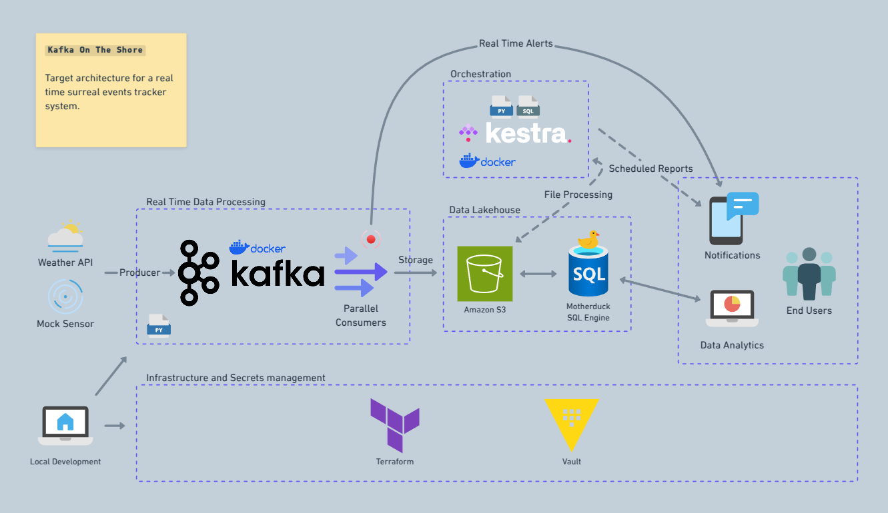

## **Kafka on the Shore - A Surreal Data Engineering Investigation**

### **Overview**
This project is inspired by the novel [*Kafka on the Shore*](https://en.wikipedia.org/wiki/Kafka_on_the_Shore) and serves as both a technical demonstration of real-time streaming with Apache Kafka and an investigative data exploration challenge.  

The premise? Mysterious events are occurring in multiple cities—like fish raining from the sky or a shadowless man walking the streets. To investigate, sensors have been placed in these locations, triggering at random intervals to gather weather data and detect surreal phenomena. 

💭 *Are these events truly supernatural? Or just a trick of the weather?* 

As a **data engineer**, the task is to build an architecture that would enable the capture, storage, and analisis of the data produced by the sensors, ultimately helping to uncover the *weather conditions* under which the events appear.  

### **Tech Stack**
- **Kafka** - Real-time data streaming  
- **Docker & Docker Compose** - Local setup  
- **Terraform** - Infrastructure as Code (AWS provisioning)  
- **Kestra** - Workflow orchestration  
- **AWS S3** - Data storage  
- **DuckDB / MotherDuck** - Cloud data warehouse for analysis  
- **Python** - Data processing & consumers  

---

### **Project Architecture**

🚀 The pipeline consists of several key components:  

1. **Kafka Producer**  
   - Simulates the surreal sensor, collecting weather data at random intervals from multiple cities.  
   - Uses OpenWeather API for real-time weather information.  
   - Publishes messages to a Kafka topic (`weather`).  

2. **Kafka Consumers**  
   - Reads weather data from Kafka.  
   - Detects if a surreal event occurred based on specific weather conditions (encoded in Python).  
   - Stores processed data into AWS S3.  

3. **Kestra Orchestration**  
   - Automates the consolidation of files uploaded to S3.  
   - Runs on a scheduled basis using Docker.  

4. **MotherDuck (DuckDB Cloud)**  
   - Queries consolidated event data directly from S3.  
   - Enables easy analysis of patterns and weather conditions associated with surreal events.  

5. **Secure Secrets Management with Vault**  

    To keep sensitive information secure, **HCP Vault** can be used to store credentials such as:  
    - AWS keys (for S3 access)  
    - Kafka broker details  
    - OpenWeather API keys  
    - Cities list for weather tracking  

    A **Terraform integration** is provided to automatically write secrets to Vault, making management easier. However, using Vault is **optional**—the project runs without it.

---

### **Investigative Challenge**  

📌 Now that we have all the infrastructure in place, this project can also serve as an **investigative challenge** for aspiring data analysts. While the logic behind event occurrences is embedded in the code, the task is to **uncover the hidden patterns using SQL and data exploration alone**.  

🔍 **How to approach the challenge:**  
1. **Run the project as is**—this will process and gather weather data, storing it in **S3** for further analysis.  
2. **Once data is collected**, use SQL to investigate patterns in the dataset. The goal is to **reverse-engineer the event triggers** by identifying which weather conditions cause specific anomalies.  
3. **Form hypotheses** based on the data and test them with queries.  
4. **Verify your hypotheses by checking the code**—once you think you've cracked the mystery, dive into the implementation to see if your analysis holds up!  

💡 *Example Hypothesis:*  
> If "The Two Moons Appearance" is reported, check if the event occurs only during clear weather and between 8 PM - 10 PM.  

This challenge encourages to think like a **data detective**, relying on real-world analytical techniques to piece together the hidden logic behind these surreal weather events. Can you solve the mystery? 🕵️‍♂️✨

---

### **How to Run the Project**

-- coming soon --

---

### **Conclusion**
This project combines **data engineering**, **real-time streaming**, and **exploratory data analysis** into a surreal investigation. It showcases how Kafka can be used for event-driven architectures and how SQL-based cloud warehouses like MotherDuck simplify querying event patterns.   

---